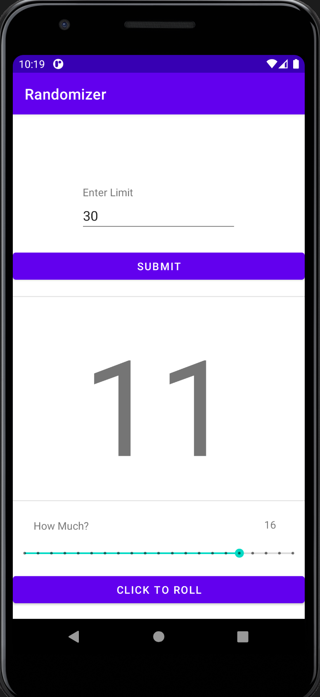

# Randomizer Android App
This is a first look for me at Android Studio
Using a tutorial, I created a simple randomizer app that is adjustable.
Upon opening the application, the seek bar will default to 20 as the max.
You can submit the new limit and the seek bar will increase.

It's not currently available on the Google Play store, for those who want to know.

# Demo

